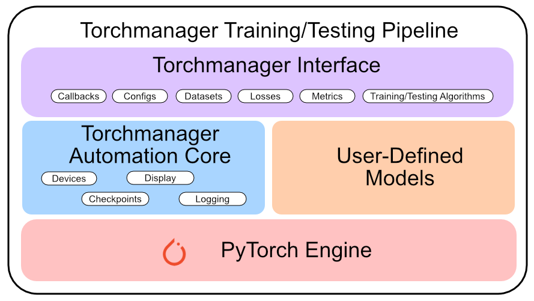

# torchmanager
### A generic deep learning training/testing framework for PyTorch


<div style="text-align: center;">

<!-- [](https://anaconda.org/conda-forge/torchmanager) -->
[](https://doi.org/10.5281/zenodo.10381715)

</div>

To use this framework, simply initialize a `Manager` object. The `Manager` class provides a generic training/testing loop for PyTorch models. It also provides some useful callbacks to use during training/testing.

## Pre-request
* Python 3.10+
* PyTorch
* Packaging
* tqdm
* PyYAML (Optional for yaml configs)
* scipy (Optional for FID metric)
* tensorboard (Optional for tensorboard recording)

## Installation
* PyPi: `pip install torchmanager`
* Conda: `conda install torchmanager -c conda-forge`

## Start from Configurations
The `Configs` class is designed to be inherited to define necessary configurations. It also provides a method to get configurations from terminal arguments.

```python
from torchmanager.configs import Configs as _Configs

# define necessary configurations
class Configs(_Configs):
    epochs: int
    lr: float
    ...

    @staticmethod
    def get_arguments(parser: Union[argparse.ArgumentParser, argparse._ArgumentGroup] = argparse.ArgumentParser()) -> Union[argparse.ArgumentParser, argparse._ArgumentGroup]:
        '''Add arguments to argument parser'''
        ...

    def show_settings(self) -> None:
        '''Display current configuerations'''
        ...

# get configs from terminal arguments
configs = Configs.from_arguments()
```

## Torchmanager Dataset
The `data.Dataset` class is designed to be inherited to define a dataset. It is a combination of `torch.utils.data.Dataset` and `torch.utils.data.DataLoader` with easier usage.

```python
from torchmanager.data import Dataset

# define dataset
class CustomDataset(Dataset):
    def __init__(self, ...):
        ...

    @property
    def unbatched_len(self) -> int:
        '''The total length of data without batch'''
        ...

    def __getitem__(self, index: int) -> tuple[torch.Tensor, torch.Tensor]:
        '''Returns a single pair of unbatched data, iterator will batch the data automatically with `torch.util.data.DataLoader`'''
        ...

# initialize datasets
training_dataset = CustomDataset(...)
val_dataset = CustomDataset(...)
testing_dataset = CustomDataset(...)
```

## The Manager
The `Manager` class is the core of the framework. It provides a generic training/testing pipeline for PyTorch models. The `Manager` class is designed to be inherited to manage the training/testing algorithm. There are also some useful callbacks to use during training/testing.

1. Initialize the manager with target model, optimizer, loss function, and metrics:
```python
import torch, torchmanager

# define model
class PytorchModel(torch.nn.Module):
    ...

# initialize model, optimizer, loss function, and metrics
model = PytorchModel(...)
optimizer = torch.optim.SGD(model.parameters(), lr=configs.lr)
loss_fn = torchmanager.losses.CrossEntropy()
metrics = {'accuracy': torchmanager.metrics.SparseCategoricalAccuracy()}

# initialize manager
manager = torchmanager.Manager(model, optimizer, loss_fn=loss_fn, metrics=metrics)
```

- Multiple losses can be used by passing a dictionary to `loss_fn`:
```python
loss_fn = {
    'loss1': torchmanager.losses.CrossEntropy(),
    'loss2': torchmanager.losses.Dice(),
    ...
}  # total_loss = loss1 + loss2
```

- Use `weight` for constant weight coefficients to control the balance between multiple losses:
```python
# define weights
w1: float = ...
w2: float = ...

loss_fn = {
    'loss1': torchmanager.losses.CrossEntropy(weight=w1),
    'loss2': torchmanager.losses.Dice(),
    ...
}  # total_loss = w1 * loss1 + w2 * loss2
```

- Use `target` for output targets between different losses:
```python
class ModelOutputDict(TypedDict):
    output1: torch.Tensor
    output2: torch.Tensor

LabelDict = ModelOutputDict  # optional, label can also be a direct `torch.Tensor` to compare with target

loss_fn = {
    'loss1': torchmanager.losses.CrossEntropy(target="output1"),
    'loss2': torchmanager.losses.Dice(target="output2"),
    ...
}  # total_loss = loss1(y['output1'], label['output1']) + loss2(y['output2'], label['output2]) if type(label) is LabelDict else loss1(y['output1'], label) + loss2(y['output2'], label)
```

2. Train the model with `fit` method:
```python
show_verbose: bool = ... # show progress bar information during training/testing
manager.fit(training_dataset, epochs=configs.epochs, val_dataset=val_dataset, show_verbose=show_verbose)
```

- There are also some other callbacks to use:
```python
tensorboard_callback = torchmanager.callbacks.TensorBoard('logs') # tensorboard dependency required
last_ckpt_callback = torchmanager.callbacks.LastCheckpoint(manager, 'last.model')
model = manager.fit(..., callbacks_list=[tensorboard_callback, last_ckpt_callback])
```

3. Test the model with test method:
```python
manager.test(testing_dataset, show_verbose=show_verbose)
```

4. Save the final trained PyTorch model:
```python
torch.save(model, "model.pth") # The saved PyTorch model can be loaded individually without using torchmanager
```

## Device selection during training/testing
Torchmanager automatically identifies available devices for training and testing. If CUDA or MPS is available, it will be used first. To use multiple GPUs, set the `use_multi_gpus` flag to `True`. To specify a different device for training or testing, pass the device to the `fit` or `test` method, respectively. When `use_multi_gpus` is set to `False`, the first available or specified device will be used.

1. Multi-GPU (CUDA) training/testing:
```python
# train on multiple GPUs
model = manager.fit(..., use_multi_gpus=True)

# test on multiple GPUs
manager.test(..., use_multi_gpus=True)
```

2. Use only specified GPUs for training/testing:
```python
# specify devices to use
gpus: list[torch.device] | torch.device = ... # Notice: device id must be specified

# train on specified multiple GPUs
model = manager.fit(..., use_multi_gpus=True, devices=gpus) # Notice: `use_multi_gpus` must set to `True` to use all specified GPUs, otherwise only the first will be used.

# test on specified multiple GPUs
manager.test(..., use_multi_gpus=True, devices=gpus)
```

## Customize training/testing algorithm
Inherited the `Manager` (`TrainingManager`) class to manage the training/testing algorithm if default training/testing algorithm is necessary. To customize the training/testing algorithm, simply override the `train_step` and/or `test_step` methods.
```python
class CustomManager(Manager):
    ...

    def train_step(x_train: Any, y_train: Any) -> dict[str, float]:
        ...  # code before default training step
        summary = super().train_step(x_train, y_train)
        ...  # code after default training step
        return summary

    def test_step(x_test: Any, y_test: Any) -> dict[str, float]:
        ...  # code before default testing step
        summary = super().test_step(x_test, y_test)
        ...  # code after default testing step
        return summary
```

Inherited the `TestingManager` class to manage the testing algorithm without training algorithm if default testing algorithm is necessary. To customize the testing algorithm, simply override the `test_step` methods.
```python
class CustomManager(TestingManager):
    ...

    def test_step(x_test: Any, y_test: Any) -> dict[str, float]:
        ...  # code before default testing step
        summary = super().test_step(x_test, y_test)
        ...  # code after default testing step
        return summary
```

Inherited the `BasicTrainingManager` class to implement the training algorithm with `train_step` method and testing algorithm with `test_step`.
```python
class CustomManager(BasicTrainingManager):
    ...

    def train_step(x_train: Any, y_train: Any) -> dict[str, float]:
        ...  # code for one iteration training
        summary: dict[str, float] = ...  # set training summary
        return summary

    def test_step(x_test: Any, y_test: Any) -> dict[str, float]:
        ...  # code for one iteration testing
        summary = ...  # set testing summary
        return summary
```

Inherited the `BasicTestingManager` class to implement the testing algorithm with `test_step` method without training algorithm.
```python
class CustomManager(BasicTestingManager):
    ...

    def test_step(x_test: Any, y_test: Any) -> dict[str, float]:
        ...  # code for one iteration testing
        summary = ...  # set testing summary
        return summary
```

## The saved experiment information
The `Experiment` class is designed to be used as a single callback to save experiment information. It is a combination of `torchmanager.callbacks.TensorBoard`, `torchmanager.callbacks.LastCheckpoint`, and `torchmanager.callbacks.BestCheckpoint` with easier usage.
```python
...

exp_callback = torchmanager.callbacks.Experiment('test.exp', manager) # tensorboard dependency required
model = manager.fit(..., callbacks_list=[exp_callback])
```

The information, including full training logs and checkpoints, will be saved in the following structure:
```
experiments
└── <experiment name>.exp
    ├── checkpoints
    │   ├── best-<metric name>.model
    │   └── last.model
    └── data
    │   └── <TensorBoard data file>
    ├── <experiment name>.cfg
    └── <experiment name>.log
```

## Please cite this work if you find it useful
```bibtex
@software{he_2023_10381715,
  author       = {He, Qisheng and
                  Dong, Ming},
  title        = {{TorchManager: A generic deep learning 
                   training/testing framework for PyTorch}},
  month        = dec,
  year         = 2023,
  publisher    = {Zenodo},
  version      = 1,
  doi          = {10.5281/zenodo.10381715},
  url          = {https://doi.org/10.5281/zenodo.10381715}
}
```

## Also checkout our projects implemented with torchmanager
* [A-Bridge (SDE-BBDM)](https://github.com/kisonho/score-based-bbdm-a-bridge) - Score-Based Image-to-Image Brownian Bridge
* [MAG-MS/MAGNET](https://github.com/kisonho/magnet) - Modality-Agnostic Learning for Medical Image Segmentation Using Multi-modality Self-distillation
* [tlt](https://github.com/kisonho/tlt) - Transferring Lottery Tickets in Computer Vision Models: a Dynamic Pruning Approach
